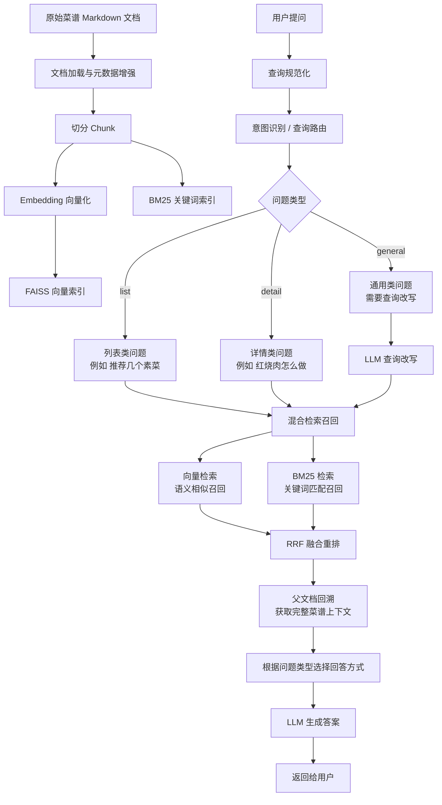

# C8 RAG 项目学习

## 1. 项目定位

C8 项目是一个菜谱领域的传统 RAG 系统。它的重点不是图检索，而是把一个基础 RAG 流程做得更工程化。

这个项目里比较值得学习的地方有三个：

```text
意图识别：先判断用户问题属于哪种类型。
混合检索召回：同时使用向量检索和 BM25 关键词检索。
RRF 重排：把不同检索器的结果融合排序。
```

如果说 C9 是在 C8 的基础上引入图数据库和图检索，那么 C8 更像是后续复杂 RAG 工程设计的基础版本。

## 2. C8 的整体流程

C8 的整体问答流程可以理解为：

```text
用户提问
-> 查询规范化
-> 意图识别 / 查询路由
-> 必要时进行查询改写
-> 混合检索召回
-> RRF 融合重排
-> 回溯完整文档
-> 根据问题类型选择回答模板
-> LLM 生成答案
-> 返回给用户
```

整体流程图如下：



## 3. 重点一：意图识别

C8 的第一个重点是意图识别，也可以叫查询路由。

系统不会把所有问题都当成同一种问答来处理，而是先判断用户问题属于哪一类。

项目里主要分成三类：

```text
list：列表类问题，比如“推荐几个素菜”“有哪些家常菜”。
detail：详情类问题，比如“红烧肉怎么做”“宫保鸡丁需要什么食材”。
general：通用类问题，比如比较开放、需要重新组织检索表达的问题。
```

这样做的好处是，不同问题可以走不同的处理方式。

例如：

```text
列表类问题更关注召回多个候选菜谱。
详情类问题更关注某一个菜谱的完整做法。
通用类问题可能需要先进行查询改写，提高检索命中率。
```

这个设计让我理解到：RAG 不只是“检索 + 生成”，前面还需要一个问题理解层。问题理解做得越清楚，后面的检索和生成就越容易稳定。

## 4. 重点二：混合检索召回

C8 的第二个重点是混合检索。

普通向量检索主要依赖语义相似度，适合处理表达不完全一致但意思接近的问题。

例如：

```text
“红烧肉怎么做”
“五花肉炖煮的家常做法”
```

这两个问题字面不完全一样，但语义接近，向量检索更容易匹配。

BM25 关键词检索更擅长精确词匹配。

例如：

```text
“宫保鸡丁”
“鱼香肉丝”
“番茄炒蛋”
```

这些菜名、食材名、专有词，如果只靠向量检索，有时可能不如关键词检索稳定。

所以 C8 同时使用两种召回方式：

```text
向量检索：解决语义相似问题。
BM25 检索：解决关键词精确匹配问题。
```

混合检索的价值在于：既能召回语义相关内容，也能保证关键词命中。

## 5. 重点三：RRF 重排

C8 的第三个重点是 RRF 重排。

RRF 的全称是 Reciprocal Rank Fusion，中文可以理解为“倒数排名融合”。

它解决的问题是：向量检索和 BM25 检索各自会返回一批结果，但这两批结果的分数体系不一样，不能简单相加。

例如：

```text
向量检索返回：A、B、C
BM25 返回：B、D、A
```

如果一个文档在两个检索器里排名都靠前，比如 A 和 B，那它大概率更可靠。

RRF 的核心思想是：不直接比较原始分数，而是比较排名。

公式可以简单理解为：

```text
RRF 分数 = 1 / (k + rank)
```

其中：

```text
rank：文档在某个检索结果中的排名。
k：平滑参数，避免排名差异过度放大。
```

如果一个文档同时被向量检索和 BM25 检索召回，它会得到两边的排名分数加成，最终排序更靠前。

这比简单拼接两个结果列表更合理。

## 6. 为什么 RRF 适合工程化 RAG

RRF 的优点是简单、稳定、容易扩展。

它不要求不同检索器的分数可比，只要求每个检索器能给出自己的排序。

这意味着以后如果系统想继续加入新的召回方式，也可以接入 RRF。

例如：

```text
向量检索
BM25 检索
图检索
规则检索
用户行为召回
```

这些检索结果都可以用类似的方式做融合排序。

所以 C8 的 RRF 设计，其实是在给后续更复杂的多路召回系统打基础。

## 7. 父子文档结构

C8 里还有一个重要细节：父子文档结构。

系统检索时通常先检索 chunk，因为 chunk 更小，语义更聚焦，召回精度更高。

但是回答时，如果只把一个很短的 chunk 交给 LLM，可能信息不完整。

所以 C8 会先用 chunk 做召回，再回溯到完整父文档。

可以理解为：

```text
检索时用小块，提高命中精度。
回答时用完整文档，提高上下文完整性。
```

这个设计也很常见，是 RAG 工程里一个很实用的技巧。

## 8. C8 和 C9 的关系

C8 和 C9 可以看成一个递进关系。

C8 解决的是传统 RAG 的工程化问题：

```text
怎么理解用户问题？
怎么同时利用语义检索和关键词检索？
怎么融合不同召回结果？
怎么让 LLM 拿到更完整的上下文？
```

C9 在这个基础上继续往前走：

```text
引入 Neo4j 知识图谱。
增加图检索能力。
支持多跳查询、路径查找、子图提取。
让路由器在传统检索和图检索之间做选择。
```

所以 C8 更像基础版工程化 RAG，C9 更像图增强版 RAG。

## 9. 项目价值总结

C8 项目的价值不在于用了特别复杂的模型，而在于它把基础 RAG 流程拆成了比较清楚的工程模块。

它让我理解到：

```text
RAG 不是简单地把文档丢进向量库。
查询前需要做意图识别。
召回时可以同时使用语义检索和关键词检索。
多路召回后需要重排融合。
回答时需要考虑上下文完整性。
```

这些能力都是后续做更复杂 RAG 系统的基础。

## 10. 面试表达模板

如果面试时介绍 C8，可以这样说：

```text
C8 是一个菜谱领域的传统 RAG 项目。我重点学习的是它的工程化检索流程。

系统在用户提问后，不是直接检索，而是先做意图识别，把问题分成 list、detail、general 等类型。不同类型的问题会使用不同的处理方式，比如列表类问题更关注多结果召回，详情类问题更关注完整菜谱上下文，通用问题可能会先做查询改写。

在检索层，项目没有只依赖向量检索，而是同时使用向量检索和 BM25。向量检索负责语义相似召回，BM25 负责关键词精确匹配，这样可以提升召回稳定性。

多路召回之后，系统使用 RRF 做结果融合重排。RRF 不直接比较不同检索器的原始分数，而是根据排名计算融合分数，因此比较适合多检索器场景。

最后系统会根据召回到的 chunk 回溯完整父文档，把更完整的上下文交给 LLM 生成答案。

这个项目让我理解到，RAG 的关键不只是调用大模型，而是前面的查询理解、召回策略、重排融合和上下文组织。
```

也可以简短表达为：

```text
我从 C8 里主要学到三点。第一是意图识别，系统会先判断用户问题类型，再决定后续处理方式。第二是混合检索召回，系统同时使用向量检索和 BM25，兼顾语义相似和关键词匹配。第三是 RRF 重排，它可以把不同检索器的结果按排名融合，提升最终召回质量。这些设计为后续更复杂的 RAG 工程，比如多路召回、图检索和智能路由打下了基础。
```

## 11. 一句话总结

```text
C8 项目的核心价值，是把基础 RAG 从“单纯向量检索”升级成了“意图识别 + 混合召回 + RRF 重排 + 父文档回溯”的工程化流程。
```
