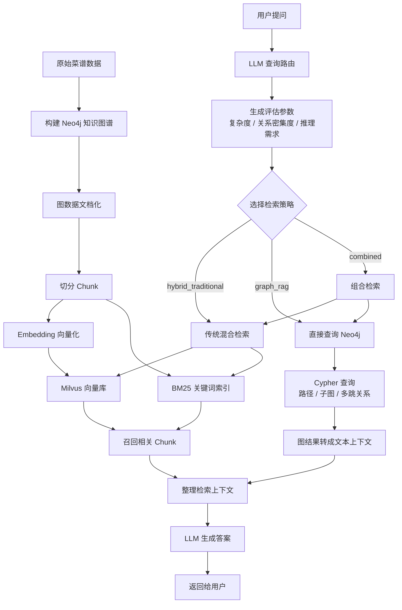

# GraphRAG 项目学习

## 1. 项目定位

C9 项目是一个菜谱领域的 RAG 系统。它在传统向量检索的基础上，引入了 Neo4j 图数据库，用图结构来表达菜谱、食材、步骤、分类之间的关系。

所以这个项目不能简单理解成“普通 RAG”，也不能说它是完整工业级 GraphRAG 框架。更准确地说，它是一个基于 Neo4j 的轻量级 GraphRAG Demo，或者说是一个 Neo4j 增强版 RAG 项目。

它的核心价值是：让 RAG 系统不只依赖文本相似度，还可以利用实体之间的关系来辅助检索和回答。

## 2. 为什么要引入图

普通 RAG 的流程通常是：

```text
原始文档 -> 切分 chunk -> 向量化 -> 向量数据库 -> 相似度检索 -> LLM 生成答案
```

这种方式适合回答语义相似的问题，比如“红烧肉怎么做”“番茄炒蛋的步骤是什么”。

但是当问题涉及实体关系、多跳关联、搭配推理时，普通向量检索就不一定稳定。例如：

```text
五花肉适合搭配什么蔬菜？
川菜的形成和地理、历史有什么关系？
某种食材常出现在哪些菜系里？
```

这些问题不只是找一段相似文本，而是要理解多个实体之间的关系。

Neo4j 图数据库可以把知识表示成：

```text
菜谱 -[需要]-> 食材
菜谱 -[包含步骤]-> 烹饪步骤
菜谱 -[属于]-> 分类
食材 -[搭配]-> 食材
```

这样系统就可以沿着关系边进行查询，而不是只靠文本相似度。

## 3. C9 的整体流程

C9 项目的整体问答流程可以理解为：

```text
用户提问
-> 智能查询路由
-> 判断问题类型和检索策略
-> 传统 RAG 检索 / 图检索 / 组合检索
-> 整理召回结果为上下文
-> 调用 LLM 生成答案
-> 返回给用户
```

其中有三种主要检索策略：

```text
hybrid_traditional：传统混合检索，主要使用向量检索、BM25 等方式。
graph_rag：图检索，直接查询 Neo4j 中的路径、子图和实体关系。
combined：组合检索，同时使用传统 RAG 和图检索。
```

整体流程图可以这样理解：



## 4. 图数据文档化

C9 项目里有一条路线是把 Neo4j 中的图数据转成文档，再进入向量数据库。

这个过程大概是：

```text
Neo4j 图数据
-> 提取菜谱、食材、步骤、分类等节点和关系
-> 拼成结构化文本 Document
-> 切分 chunk
-> embedding
-> 存入 Milvus 向量库
```

这样做的好处是，文档中天然包含一部分关系语义。例如：

```text
菜谱：红烧肉
所需食材：五花肉、冰糖、酱油
制作步骤：焯水、炒糖色、炖煮
所属分类：家常菜
```

相比普通 RAG，这种方式更容易召回和实体关系相关的内容。

但它也有局限：图结构被“拍扁”成文本以后，向量数据库只能理解文本相似度，并不知道真正的图边关系。比如它不知道：

```text
红烧肉 -[REQUIRES]-> 五花肉
红烧肉 -[CONTAINS_STEP]-> 炒糖色
五花肉 -[BELONGS_TO]-> 猪肉类
```

所以图数据文档化比普通 RAG 更强一些，但它本质上仍然是文本检索，不等于真正的图检索。

## 5. 直接图检索

C9 项目不是只做“图数据文档化”。它也有直接查询 Neo4j 的流程。

当智能路由判断问题更适合图检索时，系统会走 graph_rag 策略，通过 Cypher 查询 Neo4j。

流程可以理解为：

```text
用户问题
-> 智能路由判断为 graph_rag
-> 生成图查询策略
-> 执行 Cypher 查询 Neo4j
-> 得到路径、子图、实体关系
-> 转成文本上下文
-> 交给 LLM 生成答案
```

所以这个项目里有两条路线：

```text
第一条：图数据 -> 文档 -> 向量库 -> 文本检索
第二条：用户问题 -> Cypher -> Neo4j -> 图检索
```

第一条更像传统 RAG 的增强版，第二条才更接近 GraphRAG。

## 6. 我最值得学习的点一：查询路由

这个项目里第一个值得学习的点，是查询路由。

系统不是把所有问题都交给同一种检索方式，而是先理解用户问题，再决定后续检索策略。

它会通过 LLM 分析用户意图，生成一些评估参数，例如：

```text
query_complexity：问题复杂度
relationship_intensity：关系密集度
reasoning_required：是否需要推理
entity_count：实体数量
recommended_strategy：推荐检索策略
confidence：判断置信度
reasoning：路由原因
```

然后根据这些参数决定走哪条路线：

```text
简单事实类问题 -> 传统混合检索
关系型问题 -> 图检索
复杂问题 -> 组合检索
```

这个设计让我理解到：RAG 系统里，“怎么检索”本身也可以是一个智能决策问题，而不是固定流程。

## 7. 我最值得学习的点二：图检索概念

这个项目让我更清楚地区分了 Neo4j 和 GraphRAG。

Neo4j 是图数据库，负责存储和查询图结构。

GraphRAG 是一种方法论，核心是利用图结构参与检索、推理和上下文组织，最后辅助 LLM 生成答案。

也就是说：

```text
用了 Neo4j 不一定就是完整 GraphRAG。
但 GraphRAG 可以使用 Neo4j 作为图数据存储和查询引擎。
```

C9 项目里涉及到的图检索概念主要有：

```text
实体关系查询：查询两个实体之间是否存在直接或间接关系。
多跳查询：从一个实体出发，沿着关系边查询多层关联信息。
路径查找：寻找两个实体之间通过哪些节点和关系连接起来。
子图查询：围绕核心实体提取一片相关知识网络。
聚类查询：查找关系密集、语义相近或属于同一类别的一组节点。
```

这些能力适合回答普通向量检索不擅长的问题，比如搭配、关联、影响、来源、演变、依赖关系等。

## 8. 几个图检索概念解释

### 多跳查询

多跳查询指的是从一个节点出发，沿着关系边连续查询多层。

例如：

```text
五花肉 -> 被哪些菜使用 -> 这些菜还用了哪些蔬菜
```

它不是只查“五花肉”这个节点，而是沿着图里的关系继续扩展。

### 子图查询

子图查询是围绕一个核心实体，把它周围相关的节点和边提取出来。

例如查询“川菜的特色”，系统可能围绕“川菜”提取：

```text
川菜
-> 常见食材
-> 典型菜谱
-> 烹饪方法
-> 口味特点
-> 地域历史因素
```

这样得到的不是单个文档，而是一片相关知识网络。

### 路径查找

路径查找关注两个实体之间是如何连接的。

例如：

```text
辣椒 和 川菜 有什么关系？
```

图检索可以找到类似路径：

```text
辣椒 -> 常用于 -> 麻婆豆腐 -> 属于 -> 川菜
```

这比单纯检索“辣椒”或“川菜”的文本更适合解释关系。

### 实体关系查询

实体关系查询关注两个或多个实体之间有什么关系。

例如：

```text
五花肉和土豆能不能搭配？
红烧肉和冰糖是什么关系？
```

这类问题天然适合图结构，因为图数据库就是用节点和边表达实体关系。

### 聚类查询

聚类查询是找出某类相似或关系密集的节点。

例如：

```text
哪些菜都属于川菜？
哪些食材经常和五花肉一起出现？
哪些菜谱使用了相似的烹饪方法？
```

这类问题需要从一批节点里找共同特征，而不是只找一段文本。

## 9. 对这个项目的准确评价

这个项目有 GraphRAG 的思路，但还不是完整工业级 GraphRAG。

它已经做到了：

```text
使用 Neo4j 存储菜谱知识图谱
支持通过 Cypher 查询图路径和子图
支持传统 RAG 和图检索的路由选择
支持把图查询结果转成上下文交给 LLM
```

但它还没有做到：

```text
没有完整的社区发现和社区摘要
没有复杂的图索引体系
没有严格的检索效果评估
没有召回率、准确率、MRR、NDCG 等指标分析
没有真正的自适应学习闭环
图推理能力还比较轻量
```

所以更准确的评价是：

```text
C9 是一个 Neo4j 增强版 RAG 项目，也可以叫轻量级 GraphRAG Demo。
它展示了如何把传统文本检索和图关系检索结合起来，但还不是完整的工业级 GraphRAG 框架。
```

## 10. 面试表达模板

如果面试时介绍这个项目，可以这样说：

```text
这个项目是一个菜谱领域的 RAG 系统。我在传统 RAG 的基础上，引入了 Neo4j 图数据库，把菜谱、食材、步骤、分类之间的关系建成知识图谱。

系统不是所有问题都走同一种检索方式，而是先通过 LLM 做查询路由，分析问题复杂度、关系密集度、是否需要推理等参数，再决定使用传统混合检索、图检索还是组合检索。

传统检索部分会把图数据文档化，转成结构化文本后进入向量数据库。图检索部分则会直接查询 Neo4j，通过多跳查询、路径查找、子图提取等方式获取关系型上下文。

最后系统会把召回结果统一整理成上下文，交给大模型生成答案。

这个项目让我理解到，RAG 不一定只能依赖文本相似度。对于菜谱、食材、步骤这类天然有结构关系的数据，引入图检索可以更好地处理关系型问题和多跳推理问题。
```

也可以更简短地说：

```text
我从这个项目里主要学到两点。第一是查询路由，系统会先用 LLM 理解用户问题，生成复杂度、关系密集度、推理需求等参数，再决定走传统 RAG、图检索还是组合检索。第二是图检索本身，我更清楚了多跳查询、子图提取、路径查找、聚类查询和实体关系查询这些概念。相比普通向量检索，图检索更适合处理关系型、多实体、多步骤推理的问题。
```

## 11. 一句话总结

```text
C9 项目的核心不是“用了 Neo4j 就很高级”，而是它把 RAG 从纯文本相似度检索，扩展成了“文本检索 + 图关系检索”的双引擎结构。
```
